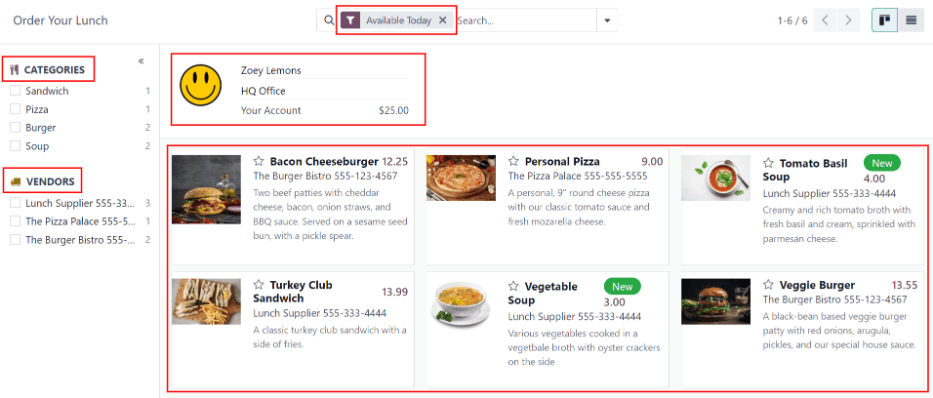
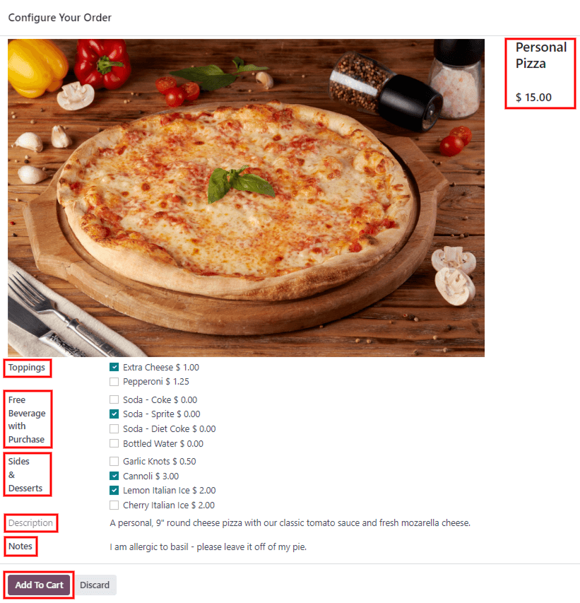

:show-content:

========
My Lunch
========

When the *Lunch* application is opened, the :guilabel:`Order Your Lunch` dashboard loads. This view
is also accessed by navigating to :menuselection:`Lunch app --> My Lunch: New Order`.

Order Your Lunch dashboard
==========================

On the main :guilabel:`Order Your Lunch` dashboard, all the necessary information needed to place an
order are visible. The default filter for the products is :guilabel:`Available Today`. This filter
shows only products that can be purchased that day.

The left-side of the dashboard displays the various :guilabel:`Categories` of products available,
along with the :guilabel:`Vendors` supplying the products. To the right of each line is a number,
which indicates how many products are associated with that respective category or vendor.

To filter the products by categories or vendors, click the checkbox next to the specific category or
vendor to view only those items.

.. note::
   If multiple selections are made, **only** products that fall under **all** the selected options
   are shown.

The top portion of the dashboard displays the user's account information, including the user's name,
location, photo, and account balance.

The main section, beneath the user's information, houses all the products in a Kanban view. Each
product card displays the name, cost, vendor (this line displays both the vendor's name and phone
number), photo, description of the product, and a :guilabel:`New` tag, if the product is configured
as new.

The products can be displayed in a list view by clicking the :guilabel:`≣ (four parallel lines)`
icon in the top-right.

Placing orders
==============

To place a lunch order, navigate to the main :guilabel:`Order Your Lunch` dashboard.

Adding items to an order
------------------------

Click on an item to order, and the item appears in a :guilabel:`Configure Your Order` pop-up window.

At the top of the pop-up window is the product image, name, and price. Beneath that are any
available :ref:`extra items or options <lunch/extra>`. Click the checkbox next to any extras to add
them to the order. Each extra is organized by a category, and lists the name and price for each
extra. As extras are selected, the price at the top updates to reflect all the selections.

Beneath the extras is the :guilabel:`Description` of the product. Underneath that is a
:guilabel:`Notes` field, where users can enter any information to be sent to the vendor regarding
the order, such as any special requests or food allergies.

When everything has been selected for the product, click the :guilabel:`Add To Cart` button in the
lower-right of the pop-up window. To cancel the order, click the :guilabel:`Discard` button.

As items are added to the order, they appear at the top center of the dashboard, beneath
:guilabel:`Your Order`. Each item is listed with the quantity, and an orange :guilabel:`To Order`
tag appears on te right side of each item.

To add more of the same item, click the :guilabel:`➕ (plus sign)` to the left of an item to increase
the quantity. To remove an item, or decrease the quantity, click the :guilabel:`➖ (minus sign)` to
the left of the quantity.

Submitting an order
-------------------

Att the top of the dashboard on the right-side, is a :guilabel:`Total` amount of the order, an
:guilabel:`Already Paid` amount, and a :guilabel:`To Pay` amount.

To place the order, click the :guilabel:`Order Now` button. The user is charged the amount that was
displayed in the :guilabel:`To Pay` field.

Once the order is placed, the tags for the items purchased in the :guilabel:`Your Order` field
change from orange :guilabel:`To Order` tags to red :guilabel:`Ordered` tags.

When placing an order for the first time for that day, the :guilabel:`Total` amount remains the
same, but the :guilabel:`Already Paid` amount changes to match the :guilabel:`Total` amount. The
:guilabel:`To Pay` field changes to zero.

Additional orders
-----------------

Additional purchases can be made after an order is initially placed.

Tracking orders
---------------

When orders have been sent to the vendors, the tags for the items under :guilabel:`Your Order`
changes to blue :guilabel:`Sent` tags.

Once orders have ben received and verified, the tags change to green :guilabel:`Received` tags.
