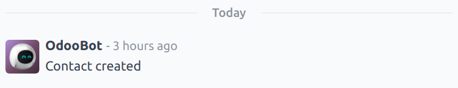
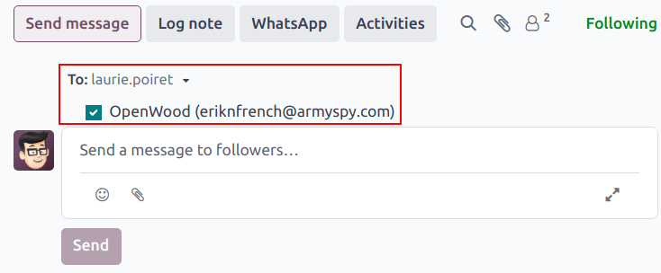

=======
Chatter
=======

The *Chatter* feature is integrated throughout the platform to streamline communication, maintain
traceability, and provide accountability among team members. Chatter windows, known as *composers*
are located on almost every record within the database, and allow users to communicate with both
internal users and external contacts. Chatter composers also allow users to log notes, upload files,
and schedule activities.

Chatter thread
==============

A chatter thread can be found on most pages in the database, and serves as a record of the updates
and edits made to a record. When a change is made, a note is logged in the chatter thread. The note
includes details of the change, and a time stamp.

.. example::
   Mitchell Admin needs to update the email address of a contact. After they save the changes to the
   contact record, a note is logged in the chatter for the contact record with the following
   information:

   - The date when the change occurred.
   - The email address as it was previously listed.
   - The updated email address.

   .. image:: chatter/chatter-thread-email-update.png
      :align: center
      :alt: A close up of a chatter thread with an update to a contact record.

If a record was created or edited via an imported file, or was otherwise updated through an
intervention by the system, the chatter thread creates a log note, and credits the change to
OdooBot.

.. _discuss/send-messages:

Send messages
=============

Chatter *composers* can be used to send messages to outside contacts, without having to leave the
database, or open a different application. This makes it easy to communicate with potential
customers in the *Sales* and *CRM* applications, or vendors in the *Purchase* app.

To send a message, first navigate to a record. For example, to send a message from a *CRM*
opportunity, navigate to :menuselection:`CRM app --> Sales --> My Pipeline` and click on the Kanban
card of an opportunity to open it. Then, at the top-right above the chatter composer, click
:guilabel:`Send message`.

If any :ref:`followers <discuss/add-followers>` have been added to the record, they are added as
recipients to the message.

.. warning::
   :ref:`Followers <discuss/add-followers>` of a record are added as recipients of a message
   automatically. If a follower should **not** receive a message, they must be removed as a follower
   before the message is sent.

         the customer listed on the opportunity record.

Edit sent messages
------------------

.. note::
   While messages can be edited after they have been sent,

.. _discuss/log-notes:

Log notes
=========

.. _discuss/schedule-activities:

Schedule activities
===================

.. _discuss/attach-files:

Attach files
============

Search messages
===============

.. _discuss/add-followers:

Add followers
=============

Integrations
============

WhatsApp
--------

:doc:`WhatsApp <../whatsapp>`

Google Translate
----------------

:doc:`Google Translate <../../general/integrations/google_translate>`

.. seealso::
   - :doc:`Discuss <../discuss>`
   - :doc:`Discuss Channels <../discuss/team_communication/>`
   - :doc:`Activities <../../essentials/activities>`
   - :doc:`WhatsApp <../whatsapp>`

